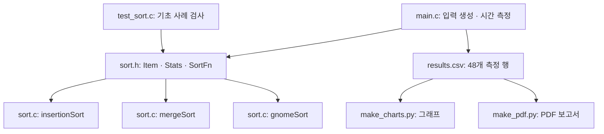
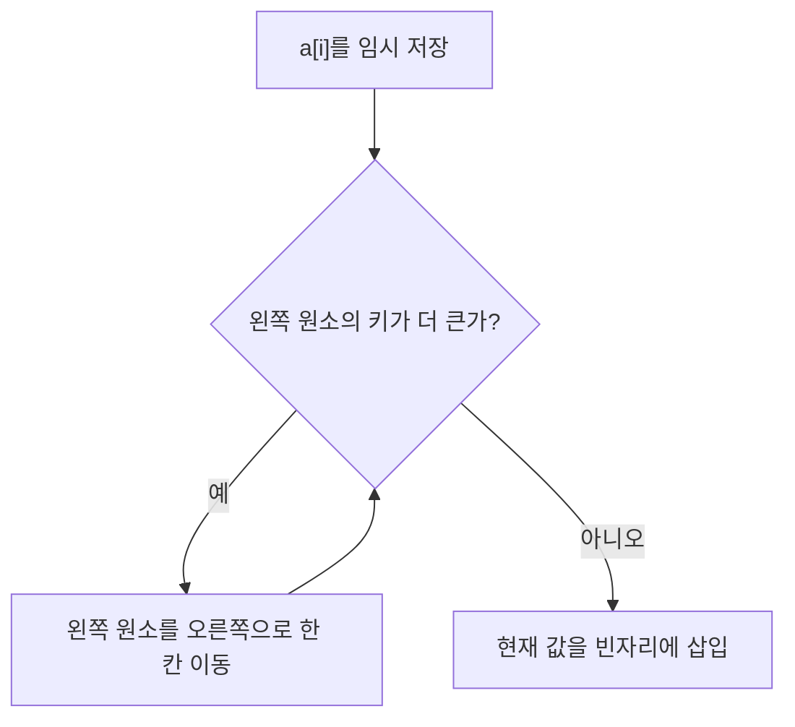
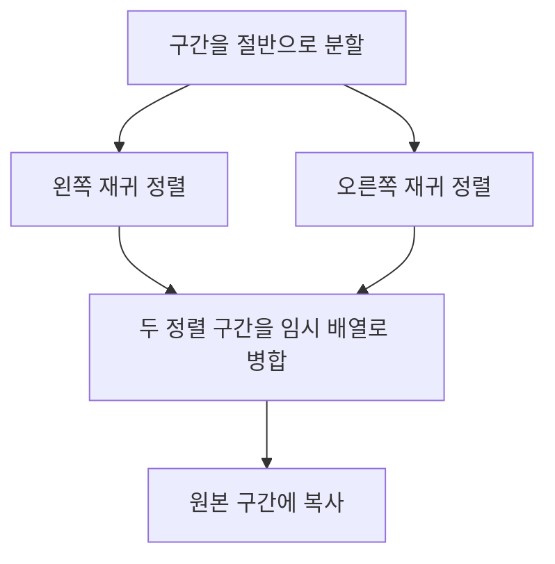
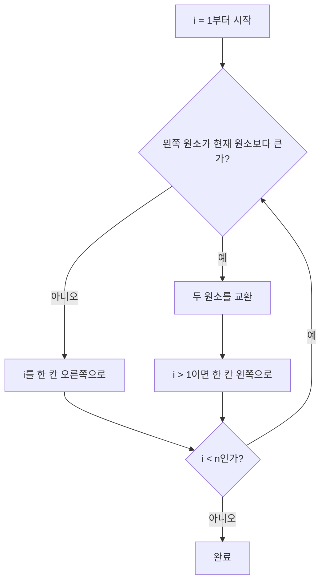
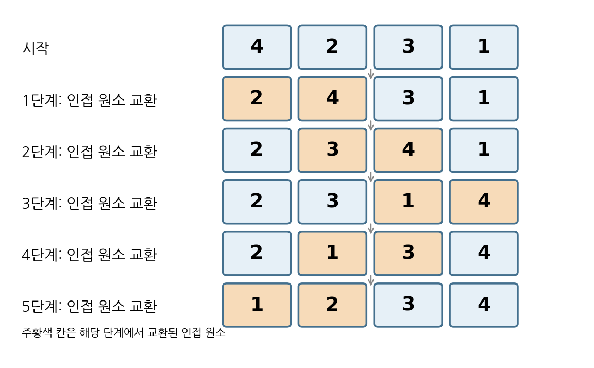
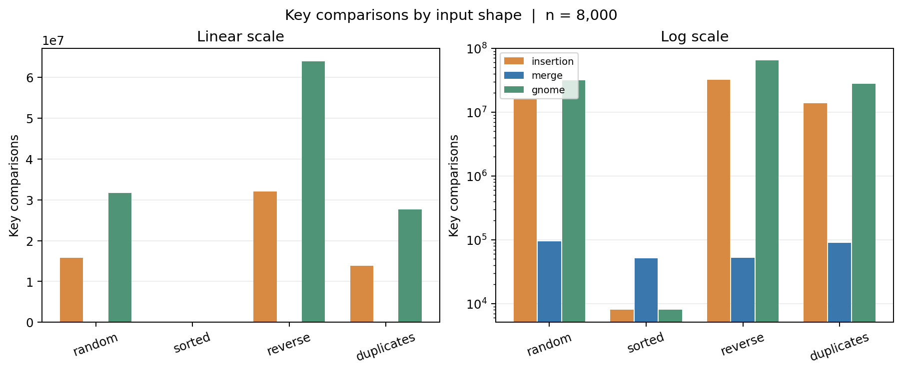
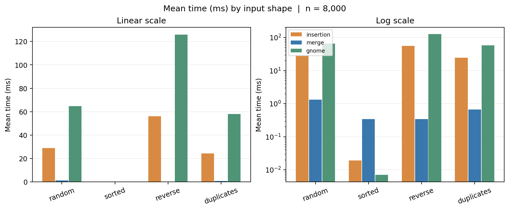
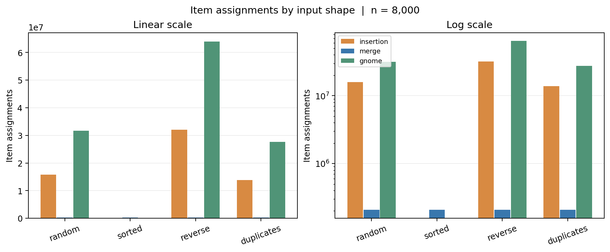
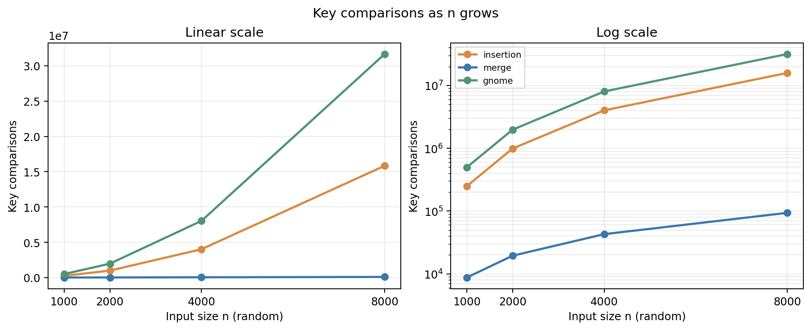
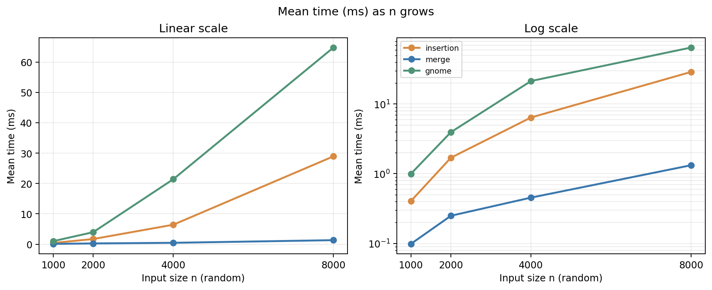

# 정렬 비교 보고서 — 삽입 · 병합 · Gnome

작성자: 변정우  
구현: [`src/sort.c`](../src/sort.c) · [`src/main.c`](../src/main.c) · [`src/sort.h`](../src/sort.h)  
재현: `make test` · `make run > report/results.csv` · `python3 report/make_charts.py`  
GitHub 저장소 URL: **게시 전 — 본인 저장소 생성 후 실제 URL을 기입할 것**

> 수업에서 배운 삽입·병합 정렬과 새로 학습한 Gnome sort를 동일한 정수 키와 동일한 입력으로 비교한다. 샘플 보고서의 **코드 보고서 → 알고리즘 상세 → 알고리즘 실험** 순서를 따르되, 구현과 측정 결과는 이 저장소의 코드와 CSV를 기준으로 작성했다.

## 차례

1. [코드 보고서](#1-코드-보고서): 파일 구성, 공통 인터페이스, 검증
2. [알고리즘 상세](#2-알고리즘-상세): 세 알고리즘의 작동 원리와 복잡도
3. [알고리즘 실험](#3-알고리즘-실험): 조건, 결과, 그래프, 해석과 한계

---

## 1. 코드 보고서

### 1.1 비교의 기준과 인터페이스

코드는 `Item { int key; int original; }` 배열을 정렬한다. `key`만 비교하고 `original`은 정렬 전 위치를 보존하므로 **동일 키의 상대 순서가 바뀌었는지** 검사할 수 있다. 세 정렬 함수는 모두 `Item *a, size_t n, Stats *s`를 인자로 받는다. `Stats`는 비교와 이동 횟수를 담는다.

```c
/* src/sort.h */
typedef struct { int key; int original; } Item;
typedef struct { unsigned long long comparisons, moves; } Stats;
typedef void (*SortFn)(Item *, size_t, Stats *);
void insertionSort(Item *, size_t, Stats *);
void mergeSort(Item *, size_t, Stats *);
void gnomeSort(Item *, size_t, Stats *);
```

샘플 보고서는 일반적인 `void *` 비교 인터페이스를 사용한다. 이 과제에서는 **정수 키와 원본 순서를 가진 고정된 `Item`**으로 범위를 한정해 코드를 간결하게 유지했다. 따라서 다른 자료형에 즉시 적용하는 범용 정렬 라이브러리는 아니다. `main.c`의 `SortFn` 배열을 통해 같은 호출 루프에서 세 함수를 차례로 실행한다.

### 1.2 파일 구조와 자료 흐름



| 파일 | 역할 | 확인할 부분 |
|---|---|---|
| `src/sort.h` | 공통 데이터와 세 함수 선언 | `Item`, `Stats`, `SortFn` |
| `src/sort.c` | 세 정렬과 공통 비교·대입 계수 | `greater`, `assign`, `mergeRec`, `gnomeSort` |
| `src/main.c` | 고정 시드 입력 생성, 반복 시간 측정, 정렬 및 안정성 관찰 | `input`, 정렬 호출 루프, CSV 출력 |
| `tests/test_sort.c` | 빈 배열, 중복, 역순, 음수 포함 기초 검사 | 3정렬 × 4입력 묶음 |
| `report/results.csv` | 실험 48행 원본 | 4형태 × 4크기 × 3정렬 |
| `report/make_charts.py` | CSV에서 그래프 생성 | 값 재측정 없이 그림 갱신 |
| `report/make_pdf.py` | PDF 생성 | 포함된 표·그림과 본문 |

측정 대상 입력은 먼저 `source`에 만든다. 각 정렬·반복 직전에 `memcpy`로 `work`를 복구하고 **정렬 호출 직전과 직후의 `clock()` 차이만** 시간에 더한다. 정렬 이후의 오름차순 검증도 측정 구간 밖에서 이루어진다. 따라서 같은 표 안의 세 알고리즘은 같은 값의 배열을 받는다.

### 1.3 비교·이동의 정의

`greater(x, y, s)` 호출 한 번을 **키 비교 1회**, `assign(dst, src, s)` 호출 한 번을 **원소 이동 1회**로 기록한다. 원소를 지역변수에 잠시 저장하는 대입과 입력 복사 `memcpy`는 이동 수에 포함하지 않는다. 이는 실제 기계 명령 수나 메모리 접근 총량이 아니라 **이 코드에서 정의한 작업 횟수**다. 삽입 정렬은 큰 값을 오른쪽으로 옮길 때, 병합 정렬은 임시 배열에 쓰고 다시 원본에 복사할 때, Gnome sort는 교환 과정의 두 배열 대입을 센다.

### 1.4 정확성 확인과 범위

`make test`는 3개 함수에 각각 4개 기초 입력 묶음을 적용해 **12개 알고리즘·입력 조합**이 통과하는지 확인한다. 모든 정렬에서 키의 비내림차순을 확인하고, 세 정렬 모두 같은 키의 `original`이 증가하는지도 검사한다. `make run` 역시 매 정렬 뒤 전체 배열을 훑어 키 순서 오류가 있으면 비정상 종료한다. 이 검사는 대표 사례의 통과를 뜻하며 모든 가능한 입력에 대한 형식적 증명은 아니다.

```sh
make test
make run > report/results.csv
python3 report/make_charts.py
python3 report/make_pdf.py
```

---

## 2. 알고리즘 상세

### 2.1 삽입 정렬: 정렬된 앞부분에 끼워 넣기

왼쪽 `a[0..i-1]`이 이미 정렬됐다고 가정하고, `a[i]`를 임시로 보관한다. 왼쪽에서 현재 값보다 **큰** 원소를 한 칸씩 오른쪽으로 옮긴 뒤 빈자리에 넣는다. 큰지 판단할 때 `>`를 사용하므로 같은 키는 앞질러 지나가지 않는다.



예: `[4, 2, 3, 1]`에서 2를 삽입하면 `[2, 4, 3, 1]`, 이어 3을 삽입하면 `[2, 3, 4, 1]`, 마지막으로 1을 삽입하면 `[1, 2, 3, 4]`다. 이미 정렬된 입력은 각 `i`마다 한 번 비교하고 옮기지 않으므로 O(n)이다. 역순에서는 앞의 모든 원소를 밀어 대략 n(n−1)/2번 비교·이동하므로 O(n²)이다. 별도의 배열은 쓰지 않는다.

### 2.2 병합 정렬: 분할하고 정렬된 부분을 합치기

`mergeRec(a, tmp, lo, hi, s)`는 구간을 반으로 나눠 각각 정렬한 뒤, 왼쪽과 오른쪽의 현재 원소 중 작은 것을 임시 배열에 쓴다. **동률이면 왼쪽을 먼저 선택**해 기존 상대 순서를 지킨다. 병합한 구간은 원본 배열로 복사한다.



예: `[4, 2, 3, 1]`은 `[4, 2]`와 `[3, 1]`로 나뉘고 각각 `[2, 4]`, `[1, 3]`이 된다. 두 구간의 앞을 비교하며 `[1, 2, 3, 4]`로 병합한다. 분할 깊이가 O(log n), 한 층의 병합 비용이 O(n)이므로 전체 시간은 O(n log n)이다. `tmp` 배열 n개와 재귀 호출 스택 O(log n)을 사용하며, 전체 추가 공간은 O(n)이다. 이 구현은 정렬된 입력에서도 병합 및 복사를 수행한다.

### 2.3 Gnome sort: AI로 학습한 새 알고리즘

**AI 학습 질문:** “Gnome sort가 인접 원소를 비교하면서 왜 뒤로 돌아가는지, 인덱스 변화와 안정성·복잡도를 작은 배열로 설명해 줘.” 설명을 받은 뒤 [NIST Dictionary of Algorithms and Data Structures의 Gnome sort 항목](https://xlinux.nist.gov/dads/HTML/gnomeSort.html)과 직접 작성한 코드·실험을 대조했다. 이 알고리즘은 수업에서 배운 두 정렬 목록에 없는 것을 새로 학습한 사례다.

Gnome sort는 현재 위치 `i`의 원소와 왼쪽 이웃을 비교한다. 두 원소가 이미 순서대로라면 `i`를 한 칸 오른쪽으로 옮기고, 역순이면 둘을 교환하고 `i`를 한 칸 왼쪽으로 옮긴다. 맨 앞에서 교환했으면 다음 위치로 진행한다. 삽입 정렬이 값을 **저장한 뒤 여러 원소를 한 칸씩 밀어** 넣는 데 비해 Gnome sort는 **인접 교환을 반복**해 값을 제자리로 보낸다.



아래 그림은 이 구현의 교환이 일어날 때마다 배열 상태를 기록한 것이다. 비교만 하고 오른쪽으로 이동한 단계는 생략했다.



`[4, 2, 3, 1]`에서는 처음 4와 2를 교환하여 `[2, 4, 3, 1]`이 된다. 4와 3도 교환해 `[2, 3, 4, 1]`을 만들고, 1이 왼쪽 이웃과 차례로 교환되면서 `[1, 2, 3, 4]`가 된다. **같은 키라면 교환하지 않으므로 안정 정렬**이다. 이 구현은 지역변수 한 개만 사용해 추가 공간 O(1)이고 재귀도 없다. 이미 정렬된 자료에서는 n−1회 비교해 최선 O(n), 일반·역순 자료에서는 앞뒤 이동과 교환이 반복되어 평균·최악 O(n²)이다. 역순의 교환 횟수는 n(n−1)/2회이며, 이 코드의 이동 계수는 교환당 2회다.

### 2.4 이론적 비교

| 알고리즘 | 최선 시간 | 평균 시간 | 최악 시간 | 추가 공간 | 안정성 |
|---|---|---|---|---|---|
| 삽입 | O(n) | O(n²) | O(n²) | O(1) | 예 |
| 병합 | O(n log n) | O(n log n) | O(n log n) | O(n) | 예 |
| Gnome sort | O(n) | O(n²) | O(n²) | O(1) | 예 |

삽입과 Gnome sort는 모두 정렬된 자료에 빠르고 제자리 안정 정렬이다. Gnome sort는 교환한 위치를 다시 방문하므로 같은 입력에서 삽입 정렬보다 비교 횟수가 많을 수 있다. 병합 정렬은 작업 배열을 사용하지만 입력 형태와 무관한 O(n log n) 상한을 제공한다.

---

## 3. 알고리즘 실험

### 3.1 입력과 측정 방법

환경은 C17, `gcc -O2 -Wall -Wextra -pedantic`이다. 무작위 입력은 고정 시드 `20260927`의 xorshift32 생성기로 만들고, 형태는 **무작위·정렬됨·역순·중복많음(키 0~7)** 네 종류다. 크기는 1,000·2,000·4,000·8,000개다. 동일한 `source`를 각 반복에 복사해 정렬을 5번 실행한다. `clock()`에 의한 5회 평균 시간(ms), 마지막 반복의 비교·이동 수, 원본 순서 위반 여부를 기록한다. 4×4×3 = 48행이 [`results.csv`](results.csv)에 있다.

| 지표 | 계산 방법 | 해석 시 주의 |
|---|---|---|
| 시간 | 정렬 호출 구간의 `clock()` 차이를 5회 평균 | 기기 부하·시계 해상도 영향 |
| 비교 | 키 비교 함수 호출 횟수 | 정렬 구현에 따라 호출 경로가 다름 |
| 이동 | `assign`에 의한 `Item` 배열 대입 횟수 | 지역변수 임시 저장과 `memcpy` 제외 |
| 안정성 관찰 | 같은 키에서 `original`의 역전 유무 | 동률이 없으면 판별 불가 |
| 추가 공간 | 코드의 작업 배열과 재귀를 분석 | CSV의 직접 측정값은 아님 |

### 3.2 입력 유형별 결과 (n=8,000)

| 입력 | 정렬 | 평균 시간(ms) | 비교 횟수 | 이동 횟수 | 재귀깊이 |
|---|---|---:|---:|---:|---:|
| 무작위 | 삽입 | 28.94740 | 15,834,821 | 15,834,824 | 1 |
| 무작위 | 병합 | 1.32520 | 93,589 | 207,616 | 14 |
| 무작위 | Gnome | 64.80320 | 31,661,643 | 31,653,666 | 1 |
| 정렬됨 | 삽입 | 0.01900 | 7,999 | 0 | 1 |
| 정렬됨 | 병합 | 0.34040 | 51,456 | 207,616 | 14 |
| 정렬됨 | Gnome | 0.00700 | 7,999 | 0 | 1 |
| 역순 | 삽입 | 56.15480 | 31,996,000 | 32,003,999 | 1 |
| 역순 | 병합 | 0.33960 | 52,352 | 207,616 | 14 |
| 역순 | Gnome | 125.89400 | 63,984,001 | 63,992,000 | 1 |
| 중복많음 | 삽입 | 24.42580 | 13,813,577 | 13,812,589 | 1 |
| 중복많음 | 병합 | 0.66360 | 89,892 | 207,616 | 14 |
| 중복많음 | Gnome | 58.08560 | 27,619,155 | 27,611,158 | 1 |


재귀깊이는 **최초 호출을 1로 센 최대 호출 단계**다. 삽입과 Gnome sort는 재귀 호출이 없어 1로 표기했다. 병합 정렬은 n=8,000을 반으로 나눠 길이 1이 될 때까지 `mergeRec`가 호출되어 최대 `⌈log₂ 8000⌉+1 = 14`단계다. 이는 코드 구조에서 계산한 값이며 `results.csv`에는 별도 계수로 저장하지 않았다.

#### 비교 횟수



선형 축에서는 병합 정렬의 막대가 거의 보이지 않으므로 오른쪽 로그 축을 함께 그렸다. 역순 8,000개에서 Gnome sort는 **63,984,001회**, 삽입은 **31,996,000회**, 병합은 **52,352회** 비교했다. Gnome sort는 교환 뒤 되돌아가 왼쪽 원소를 다시 확인하므로 같은 이차 정렬인 삽입보다 비교가 많다. 정렬된 입력에서는 삽입과 Gnome sort가 각각 7,999회만 비교한다.

#### 평균 실행 시간



선형 축에서는 역순 Gnome sort의 약 **125.894ms**가 가장 크게 보인다. 로그 축을 함께 보면 짧은 병합 및 정렬된 입력의 삽입·Gnome sort도 확인할 수 있다. 무작위 8,000개에서 병합 **1.325ms**, 삽입 **28.947ms**, Gnome sort **64.803ms**였다. 정렬된 입력의 0.01ms 안팎 수치는 `clock()` 해상도와 실행 부하에 민감하므로 작은 차이를 일반화하지 않는다.

#### 원소 이동 횟수



이동은 `assign`으로 배열에 원소 한 개를 대입할 때 1회로 센다. 역순 Gnome sort의 **63,992,000회**는 인접 교환 31,996,000번에 배열 대입 2회를 곱한 값이다. 삽입은 **32,003,999회**, 병합은 **207,616회**였다. 정렬된 입력의 삽입·Gnome sort 이동은 **0회**이므로 로그 축에 그릴 수 없어 해당 막대를 생략했다. 병합의 이동은 네 입력 형태에서 모두 207,616회다.

### 3.3 입력 크기에 따른 증가 (무작위)

#### 비교 횟수



n을 1,000에서 8,000으로 8배 늘리면 삽입 비교는 **248,855→15,834,821(약 64배)**, 병합은 **8,727→93,589(약 10.7배)**, Gnome sort는 **496,711→31,661,643(약 63.7배)** 증가한다. 두 이차 정렬의 선은 선형 축에서 급격히 올라가고, 로그 축은 작은 병합 값과 증가 속도를 함께 보여 준다.

#### 평균 실행 시간



- 삽입: 0.40520ms → 28.94740ms (약 71.4배)
- 병합: 0.09840ms → 1.32520ms (약 13.5배)
- Gnome sort: 0.99780ms → 64.80320ms (약 64.9배)

같은 무작위 입력 크기가 커질 때 병합은 두 제자리 이차 정렬보다 완만하게 증가했다. 시간은 환경의 영향을 받으므로 비교 횟수의 증가와 함께 해석한다. 이 네 크기만으로 점근 복잡도를 수학적으로 증명한 것은 아니다.

### 3.4 메모리와 안정성

| 알고리즘 | 추가 메모리 | 재귀깊이 (n=8,000) | 안정성 |
|---|---|---:|---|
| 삽입 정렬 | O(1), 지역 `Item` 한 개 | 1 (비재귀) | 안정 |
| 병합 정렬 | O(n), 임시 배열 8,000개 `Item` = 64,000 B + O(log n) 스택 | 14 | 안정 |
| Gnome sort | O(1), 교환용 지역 `Item` 한 개 | 1 (비재귀) | 안정 |

`Item`은 이 환경에서 정수 두 개로 **8 B**다. 위 64,000 B는 병합 정렬이 `malloc`으로 확보한 배열의 데이터 크기이며 할당 관리 비용과 재귀 스택의 정확한 바이트 수는 포함하지 않는다. 재귀깊이는 메모리 바이트 수와 다른 지표다. 세 구현은 같은 키를 앞지르지 않으므로 안정성을 유지한다. 삽입과 Gnome sort는 적은 추가 공간을 쓰지만 무작위·역순 큰 입력에서 이차 증가를 보였고, 병합은 배열 메모리를 사용하는 대신 훨씬 적은 비교·이동과 시간을 기록했다.

### 3.5 한계와 재현

시간 값은 한 실행 환경에서 5회 평균한 결과다. 다른 컴파일러·CPU·부하에서는 순위와 배수가 달라질 수 있다. `clock()`은 벽시계 시간이 아니라 C 실행 환경에서 제공하는 프로세서 시간이며, 각 호출의 미세한 시간 차이는 해상도의 영향을 받는다. xorshift32의 시드는 고정되어 입력은 재현 가능하지만, 정렬 함수의 실행 시간은 재실행할 때 조금 달라진다. 비교·이동 횟수와 그래프는 저장된 [`results.csv`](results.csv)에서 확인할 수 있다.

## 참고 자료

1. 과제 샘플의 [`report/REPORT.md`](https://github.com/lec-algorithm/hw1-sample-2026/blob/main/report/REPORT.md): 보고서 순서와 비교 항목 참고. 이 보고서의 구현과 실험값은 별도 작성.
2. Wikipedia, [Sorting algorithm — Comparison of algorithms](https://en.wikipedia.org/wiki/Sorting_algorithm#Comparison_of_algorithms): 과제에 제시된 정렬 목록과 비교표, 2026-09-29 열람.
3. NIST Dictionary of Algorithms and Data Structures, [Gnome sort](https://xlinux.nist.gov/dads/HTML/gnomeSort.html): 인접 교환, 안정성 및 제자리 특성 대조, 2026-09-29 열람.

**제출 전:** 본인 GitHub에 코드를 게시하고 맨 위의 URL을 실제 주소로 교체한 뒤 PDF를 다시 생성한다. 필수 ZIP은 그 저장소의 **Code → Download ZIP** 메뉴에서 받는다.
